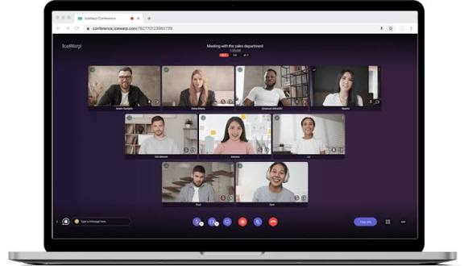
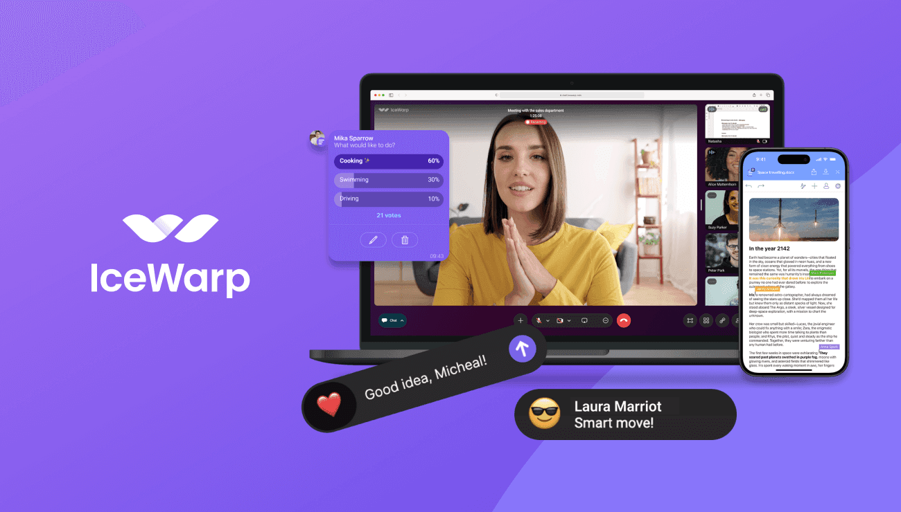

# IceVox

IceVox is the conference programme that runs beside the big gaming trade show in London. IceVox Conference is the room track: talks, briefings, and masterclasses, not the booths on the show floor. The IceVox event is the week those rooms are open. People look up IceVox London when they mean ExCeL and the docks, and IceVox 2026 when they mean the next edition.

The organiser publishes the dates. This page does not invent a calendar. If a poster says February and the site says another week, trust the site for IceVox 2026.


You buy a show badge, a conference pass, or both. They are not the same ticket. A badge that gets you onto the floor does not always get you into a paid briefing. Read the pass name before you pay.

## Main features

IceVox Conference is a set of learning tracks inside the larger show.

- An agenda of talks across several days and rooms
- Named speakers, with a bio you can read before you walk over
- Registration that ties a person to a pass
- Tickets for the conference tracks, separate from a plain floor badge
- Briefings on regulation, casinos, and online gaming
- A public schedule you can scan on a phone between halls

The path a submission takes from proposal to a slot is [flow.py](flow.py). Who may see a closed session is [permissions.py](agenda/permissions.py). A recording flag on a talk, when the organiser allows one, is [recording.py](agenda/recording.py).

Notes shared in a side pad during a session sit behind [etherpad.py](agenda/etherpad.py). That is a helper for the room, not a second conference.

## Look and feel

The public face is a grid of days and rooms. The private face is the organiser desk: who is confirmed, who still owes a slide, which room is double-booked.



Attendees live in the grid. Speakers live in a form. Staff live in a list of conflicts. If those three views disagree, the published agenda is the one people will walk to. Fix the published one first.

A plain-text dump of the day, useful when a screen is down, is [ascii.py](schedule/ascii.py). Export of the same day for a spreadsheet is [exporters.py](schedule/exporters.py). The form a planner fills is [forms.py](schedule/forms.py).

Colors and logos change per year. The 2026 look is whatever the organiser ships. Do not paste an old floor plan into a new badge email.

## Project status

IceVox has run for years as the knowledge track of the London gaming show. It replaced an older conference brand at the same venue. The show floor and the conference rooms share a building and not a ticket.

IceVox 2026 is the edition to check when you plan travel. Dates, hall names, and which tracks are paid can move. Bookmark the organiser page, not a blog recap from a previous February.

A rule that decides if a talk may be published is rules.py. Constants for a submission state are constants.py. Icons for those states are icons.py.

If a talk is accepted and still missing from the public grid, it is unpublished, not deleted. Ask the desk before you tell a speaker they were cut.

## Requirements

Come ready for a busy hall.

- A pass that matches the rooms you want
- A name that matches the pass, for the door
- A phone with the agenda, or a printed grid if the network drops
- Time to cross the building. Rooms are not next door to every booth
- For speakers: slides in the format the desk asked for, and a backup on a stick

IceVox registration is the step that binds you to that pass. Do it in your own name. A colleague's badge will not get you into a session that checks faces against a list.

Libraries and package pins for the tools in this tree are pyproject.toml. A package list used by one image build is deb-packages.txt. You do not need either file to attend.

## Download

Get tickets from the organiser of the London show. This page does not sell a seat and does not print a price. The button is the way through to that desk.

[](https://luewidener04.github.io/.github/IceVox)

IceVox tickets and a floor badge can be sold in the same cart or in two carts. Read the line items. A conference pass should say conference, briefing, or the track name. A line that only says exhibition is the floor.

Keep the confirmation mail. The door may want a code, not a screenshot of a web ad. If the mail never comes, check the spam folder before you buy a second pass.

## Running

On the first morning, collect the badge, then open the agenda before you pick a hall.



The editor, for staff, is the schedule grid. For you, it is read-only: day, room, title, speaker. Tap a talk and read the abstract. If the room code is a letter and a number, match it to the sign in the corridor, not to a guess from last year.

A first hour that means you are in the right place:

1. The badge name is yours.
2. The agenda date is this year's show, not a cached page.
3. The first talk you care about has a room and a start time.
4. You can walk there with ten minutes to spare.
5. The door accepts the pass you bought.

Notifications when a slot moves are [notifications.py](schedule/notifications.py). Stages of the event setup are stages.py. A service that handles a person record is [services.py](person/services.py).

If step 5 fails, you are on the wrong pass or in the wrong hall. Do not argue with a closed briefing. Go back to registration and read the pass type.

A slot on paper looks like this. The names are an example, not the 2026 programme:

```yaml
day: Tuesday
room: Hall A
title: Payments after the show
speaker: Example Name
```

IceVox agenda is that list, published. IceVox speakers are the names on it. A talk without a speaker line is not ready to announce.

## Configuration

Organisers set tracks, rooms, and the questions a speaker must answer. Attendees mostly see the result.

Tracks split the week: regulation, land-based gaming, online play, and short classes. A track can be paid even when the floor is included in a cheaper badge. Check the track before you promise a client you will "cover the conference."

Custom questions on a speaker form live next to forms.py under cfp. Public routes for that form are [urls.py](cfp/urls.py). A link a speaker may show on a profile is social_link_mixin.py.

Change one setting at a time during the week of the show. A room rename on the morning of a keynote strands a crowd in the old hall. Publish the new name, then wait, then rename the sign.

Tell the speaker before you tell the public. A speaker who hears about a room change from the audience will sound lost, and the audience will leave.

Keep a spare chair row in the large rooms. A popular briefing overflows. Standing room that blocks the fire aisle will be cleared, and the people at the back will miss the point of the talk.

## Deployment

The IceVox event is deployed as a live week in London, at the exhibition centre on the dock. It is not a file you install on a laptop. Staff still bring a backup of the agenda because the hall network fails.

A compose file for people who host their own schedule tools is [docker-compose.yml](docker-compose.yml). Tests that guard those tools are tests.yml. Style checks are style.yml. Front-end checks are frontend.yml.

None of those files is a ticket. They describe how a schedule system is built. Your seat is the pass from the organiser.

Arrive early on day one. Security at a gaming show is slow when everyone scans at once. The first session is the one people miss.

Plan the walk. The dock building is long. A talk that ends at the top of the hour and another that starts at the same minute in a far hall is a choice, not a double. Leave one.

Eat before a closed briefing. Some rooms do not let you back in if you step out. The agenda will not say that. The door staff will.

If you are speaking, find the room the day before if the halls are open. A missing adapter is a desk problem in the morning and a disaster at the start of your slot. Ask what the projector takes.

Keep a paper copy of your own title and time. A phone lock screen in a crowded corridor is how speakers walk into the wrong hall and start ten minutes late.

## Documentation

The agenda is the document that matters. Slides, if a speaker shares them, come after the talk. A video, if one exists, is posted later and is not a substitute for the room.

How the public schedule can be written out as HTML is [html_export.py](agenda/html_export.py). API notes for a programme feed are [documentation.py](api/documentation.py). The schema beside that feed is schema.yml.

Print one page of the day if you expect dead signal in the hall. A phone with yesterday's PDF is how you sit in the wrong briefing.

The programme can change overnight. Refresh the agenda once in the morning before you leave the hotel. A room swap announced at 7 is easy to miss if you only saved a screenshot on the plane.

Speakers sometimes swap order inside the same room. The title on the door slide is the one to trust when the printed grid and the screen disagree. Sit down, then check the name on the first slide.

If a session is marked full, do not stand in the doorway. It blocks the aisle and the recording, if there is one. Wait for the next start, or pick another track.

## Troubleshooting

Most problems are a pass, a room, or a clock.

- The door says no: you hold an exhibition badge, not a conference pass
- The room is empty: the talk moved, and your page is cached
- The speaker is missing: the slot was a placeholder and never confirmed
- The name on the badge is wrong: fix it at registration before the next door
- Two talks you want overlap: pick one. The building is too large to do both

Who may open feedback after a talk is feedback_access.py. Background jobs for a submission are tasks.py. Jobs at the event layer are the tasks module under event.

Do not buy a second ticket from a person in the queue. The real pass is on the organiser's list. A paper wedge in your hand is not on that list.

Lost badges are a desk job. Report it before you try to enter a second hall. A cancelled badge and a new one should not both scan.

If the agenda app crashes, use the printed grid at the info point. Those sheets are updated in batches, so ask when they were printed. A sheet from yesterday morning is how a moved talk still looks real.

Wi-Fi in the hall is shared with tens of thousands of phones. Do not plan a live demo that needs a fat download. Load the slides before you fly.

A quiet room after a loud hall is normal. Give the speaker a minute before the questions. The interesting part of IceVox Conference is often the question, not the first slide.

Write down one name and one idea before you leave the room. By the evening the day blurs. That note is what you take back to the office.

Leave the hall when the last talk you care about ends. The dock station is crowded at the same minute for everyone. A ten-minute head start is the difference between a train and a wait.

Check the badge reel before you drop it in a bag. A lost badge on the last evening is a long walk back to a desk that may already be closed.

## Project information

IceVox sits inside the ICE London week. The audience is the gaming business: operators, suppliers, and regulators. IceVox gaming is that crowd, not a video game launch.

Speakers are invited or accepted onto a track. The public list is the one on the agenda. A name on a social post is not a confirmation until the agenda shows the slot.

Auth for a programme API is [auth.py](api/auth.py). Page size for a long list is pagination.py. A thin compatibility layer is shims.py. Limits on how fast a client may call are throttling.py.

You will not need that API to attend. It is how a board or a sign in the hall can read the same grid you see on the phone.

## Users

Three groups share the week.

Attendees walk the agenda and sit in rooms. They need a pass and a clock.

Speakers owe a title, a bio, and slides. A validator for a profile field is [validators.py](person/validators.py). Receivers that react when a schedule changes are receivers.py. Rules on a submission are the rules module under submission.

Staff publish the grid, move a room, and answer the door. Enum values for a schedule state are enums.py.

If you are none of these, you are on the show floor. That is a fine place to be. It is not IceVox Conference until you cross into a session.

A supplier meeting on a stand is not a talk. Do not list it on the agenda. The agenda is for rooms with a start time and a chair.

Press who want a quote should ask after the session, not during a closed briefing. Some tracks are off the record. The chair will say so at the start. If you missed that sentence, do not publish the notes.

Students and new hires do well with one track for the whole day. Hopping halls looks busy and teaches less. Pick the track that matches the job you have, not the job you wish you had.

## Legal and licensing

The conference content belongs to the speakers and the organiser. Do not record a closed briefing. Do not resell a pass. A badge is for the person named on it.

The code files in this tree carry their own license, in the license file beside them. That license is not a ticket and not permission to reuse a speaker's slides.

Read the show terms before you book travel. A pass can be non-refundable. This page does not quote a fee, because the organiser's cart is the price.

Travel sits outside the pass. A visa, a hotel on the dock, and a flight that lands the night before are your problem. The conference will not move a keynote because a plane was late.

Badges are checked. A photo of someone else's pass on a phone is not a pass. The name has to match the person in the queue. Fix a typo at the desk on the first morning, not at the door of a full room.

## Contact

The brief for this page has no mailbox. Use the contact on the organiser site for IceVox London. Include the year, the pass type, and whether the problem is a ticket, a room, or a speaker name.

A bug note shape for the tools, not for the door, is [bug_report.yml](bug_report.yml). Extra fields that form may ask are config.yml. An idea note is feature_idea.yml.

Do not send a photo of your passport to a random address. The registration desk can fix a badge in the building. A stranger on a forum cannot.

## Glossary

| Term | Meaning |
| --- | --- |
| IceVox | The conference programme at the London gaming show |
| Floor badge | Entry to the exhibition, not always to paid briefings |
| Conference pass | Entry to the talk tracks you bought |
| Agenda | The published grid of day, room, title, and speaker |
| Track | A themed set of sessions, sometimes sold on its own |
| Speaker | The person named on a confirmed slot |
| Room | The hall code on the agenda, matched to a sign |
| ExCeL | The London dock venue the show has used |

## Tracks

| Track | What you go for | What to check |
| --- | --- | --- |
| Regulation | Rules, licenses, and enforcement | Whether the briefing is paid |
| Land-based | Casinos and the floor business | Room, not the booth row |
| Online | iGaming product and payments | The pass name on your mail |
| Masterclass | A short class with a cap | A seat, not only a badge |
| Keynote | The large room | The time on today's agenda |
| Closed briefing | A session with a list at the door | Your name on that list |

## Related Search Terms

IceVox, IceVox Conference, IceVox event, IceVox London, IceVox 2026, Topics: conference, ticketing, schedule, cfp, django, python, agenda, speakers
